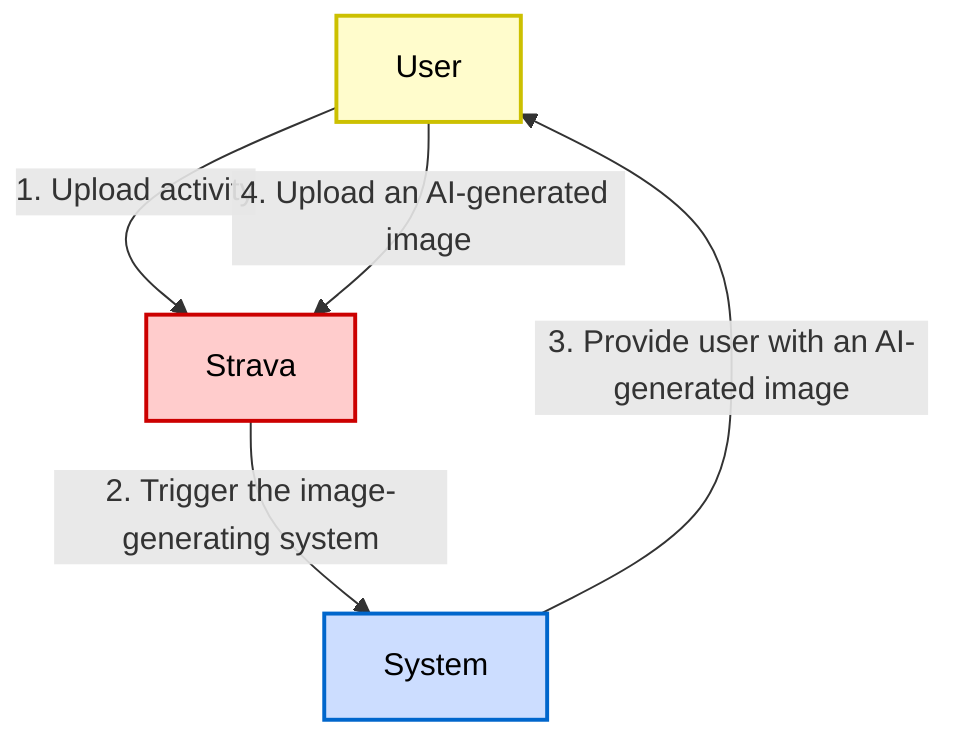
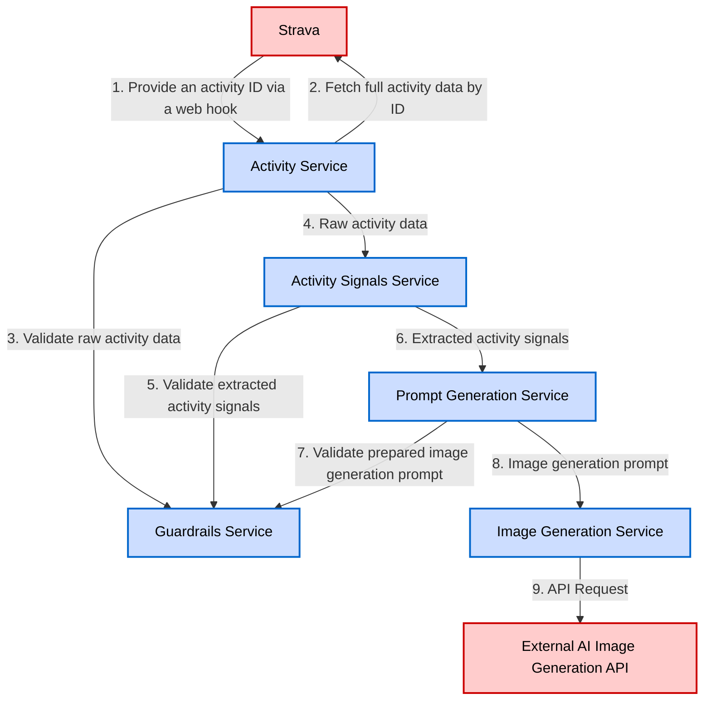

# PACE: Personal Activity Canvas Engine (Strava Activity Image Generator)

## OpenSpec Instructions

These instructions are for AI assistants working in this project.

Always open `/openspec/AGENTS.md` when the request:
- Mentions planning or proposals (words like proposal, spec, change, plan)
- Introduces new capabilities, breaking changes, architecture shifts, or big performance/security work
- Sounds ambiguous and you need the authoritative spec before coding

Use `/openspec/AGENTS.md` to learn:
- How to create and apply change proposals
- Spec format and conventions
- Project structure and guidelines

Keep this managed block so 'openspec update' can refresh the instructions.

## System Purpose

This system is an **AI-powered image generator for Strava activities** that creates personalized, artistic visualizations based on activity data. The system transforms structured Strava activity metadata into safe, deterministic, and aesthetically pleasing images that capture the essence of athletic achievements.

## Guardrails

Guardrails are explicit constraints that ensure predictable, safe, and consistent behavior of AI-driven components. Guardrails are part of the system specification. Any behavior not allowed by guardrails is considered undefined and must be prevented or safely handled by the implementation.

These guardrails apply to the whole system. Code that violates these guardrails is considered incorrect, even if it appears to work.

The complete guardrails specification is maintained in OpenSpec format:

- **[Input Guardrails](openspec/specs/input-guardrails/spec.md)**: Activity data validation, user-provided text processing, and tag handling
- **[Prompt Guardrails](openspec/specs/prompt-guardrails/spec.md)**: Image generation prompt content rules and size limits
- **[Image Guardrails](openspec/specs/image-guardrails/spec.md)**: Image style, output characteristics, retry/fallback strategies, failure handling, and determinism

For detailed requirements and scenarios, refer to the specifications in `openspec/specs/`.

## System Architecture

### Core Principles

1. **Single Responsibility**: Each module has one clear purpose.
2. **Loose Coupling**: Modules communicate through well-defined interfaces.
3. **High Cohesion**: Related functionality is grouped together.
4. **Dependency Injection**: Dependencies are explicit and injected.
5. **Testability**: Each module can be tested in isolation.
6. **Resilience**: Failures in one module don't cascade.

### User Journey



The system is designed as a modular, service-oriented architecture with clear separation of concerns and well-defined interfaces between components.

### Services

1. **Guardrails:** Enforces all safety and content restrictions.
2. **Activity:** Manages Strava API integration and activity data retrieval.
3. **Activity Signals:** Extracts semantic signals from raw Strava activity data.
4. **Prompt Generation:** Generates text prompts for image generation based on extracted Strava activity signals.
5. **Image Generation:** Generates Strava activity image based on the prompt derived from the activity data.

#### Service Dependency Graph



#### Service Dependency Matrix

| Service                       | Direct Dependencies                                   | Purpose of Dependency                    |
|-------------------------------|-------------------------------------------------------|------------------------------------------|
| **Guardrails Service**        | None                                                  | Independent validation service           |
| **Activity Service**          | 1. Guardrails Service                                 | 1. Content validation                    |
| **Activity Signals Service**  | 1. Guardrails Service                                 | 1. Signal validation                     |
| **Prompt Generation Service** | 1. Activity Signals Service<br/>2. Guardrails Service | 1. Signal input<br/>2. Prompt validation |
| **Image Generation Service**  | 1. Prompt Generation Service                          | 2. Prompt source                         |

#### Guardrails Service

**Purpose**: Enforces all safety and content restrictions.

**Responsibilities**:
- Validate content against forbidden lists.
- Check for prohibited patterns.
- Sanitize user input and system output.
- Enforce compliance rules.

**Dependencies**:
- None

**Interface**:
```typescript
interface GuardrailsService {
  validateActivity(activity: Activity): ValidationResult
  validateActivitySignals(signals: ActivitySignals): ValidationResult
  validateActivityImagePrompt(prompt: ActivityImagePrompt): ValidationResult
}
```

#### Activity Service

**Purpose**: Manages Strava API integration and activity data retrieval.

**Responsibilities**:
- Authenticate with Strava API.
- Fetch activity data.
- Transform API responses to internal format.

**Dependencies**:
- Guardrails Service

**Interface**:
```typescript
interface ActivityService {
  fetchActivity(activityId: string): Promise<Activity>;
}
```

#### Activity Signals Service

**Purpose**: Extracts semantic signals from raw Strava activity data.

**Responsibilities**:
- Parse user-provided text safely.
- Extract activity signals from the Strava API response: subject, style, mood, scene, and others.

**Dependencies**:
- Guardrails Service

**Interface**:
```typescript
interface ActivitySignalsService {
  getSignals(activity: Activity): Promise<ActivitySignals>;
}
```

#### Prompt Generation Service

**Purpose**: Generates text prompts for image generation based on extracted Strava activity signals.

**Responsibilities**:
- Apply prompt generation rules.
- Select appropriate style.
- Compose scene descriptions.
- Validate prompt safety.

**Dependencies**:
- Activity Signals Service
- Guardrails Service

**Interface**:
```typescript
interface PromptGenerationService {
  generatePrompt(signals: ActivitySignals): ActivityImagePrompt
  getFallbackPrompt(): ActivityImagePrompt
}
```

#### Image Generation Service

**Purpose**: Generates Strava activity image based on the prompt derived from the activity data.

**Responsibilities**:
- Submit prompts to image generation API.
- Handle generation retries.
- Manage rate limiting.

**Dependencies**:
- Prompt Generation Service

**Interface**:
```typescript
interface ImageGenerationService {
  generateImage(prompt: ActivityImagePrompt): Promise<ActivityImage>
  regenerateWithFallback(prompt: ActivityImagePrompt): Promise<ActivityImage>
}
```

### Data Flow

#### Primary Flow: New Activity to AI Image Generation

1. **Input**: Activity ID from the Strava web hook.
2. **Activity Service**: Fetches activity from the Strava API.
3. **Guardrails Service**: Validates raw activity data for safety.
4. **Activity Signals Service**: Extracts semantic signals from the raw Strava activity data.
5. **Prompt Generation Service**: Creates image prompt based on extracted activity signals.
6. **Guardrails Service**: Validates image prompt for safety.
7. **Image Generation Service**: Generates image using the prompt.
8. **Output**: Generated image URL is shared with the requestor.

#### Error Flow

1. Any service failure triggers error logging.
2. Fallback mechanisms activate for persistent failures.
3. System returns a safe default output.

### Testing Strategy

#### Unit Testing

- Each service **MUST** be tested in isolation.
- Mock dependencies are injected.
- 100% coverage for critical paths.
- Edge cases and error conditions.

#### Integration Testing

- Test service interactions.
- Verify data flow.
- Test error propagation.
- Validate contracts.

#### End-to-End Testing

- Complete flow validation.
- Failure scenario testing.

### Deployment Considerations

#### Service Packaging

- Each module as separate package.
- Clear version management.
- Dependency declaration.
- Build automation.

#### Configuration Management

- Environment-specific configs.
- Secret management.

#### Scalability

- Stateless service design.
- Horizontal scaling capability.
- Rate limiting.

### Future Extensions

The architecture supports future additions:
- New activity types.
- Additional image styles.
- Multiple AI model providers.
- User preferences.
- Batch processing.
- Webhook integrations.

## Core Functionality

The system operates as a **rule-based, deterministic pipeline** that:

1. **Ingests Strava activity data** via the [Strava API](https://developers.strava.com/).
2. **Extracts semantic signals** from activity metadata (type, distance, heart rate, elevation, tags, etc.).
3. **Generates text prompts** following strict safety and content guardrails
4. **Creates artistic images** using AI image generation models.
5. **Validates outputs** to ensure compliance with all system constraints.

### Strava Get Activity API

[The Strava Get Activity API is described in detail here.](https://developers.strava.com/docs/reference/#api-Activities-getActivityById) The endpoint returns the requested activity that is owned by the authenticated athlete. Requires `activity:read` for `Everyone` and `Followers` activities. Requires `activity:read_all` for `Only Me` activities. Review the Strava documentation periodically and update this section when Strava API changes are recognized.

```text
GET /activities/{activityId}
```

#### Parameters

- `id: string` - The identifier of the  Required.

#### Sample Response

```json
{
  "id" : 12345678987654321,
  "resource_state" : 3,
  "external_id" : "garmin_push_12345678987654321",
  "upload_id" : 98765432123456789,
  "athlete" : {
    "id" : 134815,
    "resource_state" : 1
  },
  "name" : "Happy Friday",
  "distance" : 28099,
  "moving_time" : 4207,
  "elapsed_time" : 4410,
  "total_elevation_gain" : 516,
  "type" : "Ride",
  "sport_type" : "MountainBikeRide",
  "start_date" : "2018-02-16T14:52:54Z",
  "start_date_local" : "2018-02-16T06:52:54Z",
  "timezone" : "(GMT-08:00) America/Los_Angeles",
  "utc_offset" : -28800,
  "start_latlng" : [ 37.83, -122.26 ],
  "end_latlng" : [ 37.83, -122.26 ],
  "achievement_count" : 0,
  "kudos_count" : 19,
  "comment_count" : 0,
  "athlete_count" : 1,
  "photo_count" : 0,
  "map" : {
    "id" : "a1410355832",
    "polyline" : "ki{eFvqfiVqAWQIGEEKAYJgBVqDJ{BHa@jAkNJw@Pw@V{APs@^aABQAOEQGKoJ_FuJkFqAo@{A}@sH{DiAs@Q]?WVy@`@oBt@_CB]KYMMkB{AQEI@WT{BlE{@zAQPI@ICsCqA_BcAeCmAaFmCqIoEcLeG}KcG}A}@cDaBiDsByAkAuBqBi@y@_@o@o@kB}BgIoA_EUkAMcACa@BeBBq@LaAJe@b@uA`@_AdBcD`@iAPq@RgALqAB{@EqAyAoOCy@AmCBmANqBLqAZkB\\iCPiBJwCCsASiCq@iD]eA]y@[i@w@mAa@i@k@g@kAw@i@Ya@Q]EWFMLa@~BYpAFNpA`Aj@n@X`@V`AHh@JfB@xAMvAGZGHIDIAWOEQNcC@sACYK[MSOMe@QKKKYOs@UYQISCQ?Q@WNo@r@OHGAGCKOQ_BU}@MQGG]Io@@c@FYNg@d@s@d@ODQAMOMaASs@_@a@SESAQDqBn@a@RO?KK?UBU\\kA@Y?WMo@Iy@GWQ_@WSSGg@AkABQB_Ap@_A^o@b@Q@o@IS@OHi@n@OFS?OI}@iAQMQGQC}@DOIIUK{@IUOMyBo@kASOKIQCa@L[|AgATWN[He@?QKw@FOPCh@Fx@l@TDLELKl@aAHIJEX@r@ZTDV@LENQVg@RkA@c@MeA?WFOPMf@Ej@Fj@@LGHKDM?_@_@iC?a@HKRIl@NT?FCHMFW?YEYGWQa@GYBiAIq@Gq@L_BHSHK|@WJETSLQZs@z@_A~@uA^U`@G\\CRB\\Tl@p@Th@JZ^bB`@lAHLXVLDP?LGFSKiDBo@d@wBVi@R]VYVE\\@`@Lh@Fh@CzAk@RSDQA]GYe@eAGWSiBAWBWBIJORK`@KPOPSTg@h@}Ad@o@F[E_@EGMKUGmAEYGMIMYKs@?a@J}@@_BD_@HQJMx@e@LKHKHWAo@UoAAWFmAH}@?w@C[YwAAc@HSNM|Ao@rA}@zAq@`@a@j@eAxAuBXQj@MXSR[b@gAFg@?YISOGaAHi@Xw@v@_@d@WRSFqARUHQJc@d@m@`A[VSFUBcAEU@WFULUPa@v@Y~@UrBc@dBI~@?l@P~ABt@N`HEjA]zAEp@@p@TrBCl@CTQb@k@dAg@jAU^KJYLK@k@A[Js@d@a@b@]RgBl@[FMAw@[]G]?m@D_@F]P[Vu@t@[TMF_@Do@E_@@q@P]PWZUZw@vAkAlAGJOj@IlAMd@OR{@p@a@d@sBpD]v@a@`Aa@n@]TODgBVk@Pe@^cBfBc@Rs@La@RSPm@|@wCpDS^Wp@QZML{@l@qBbCYd@k@lAIVCZBZNTr@`@RRHZANIZQPKDW@e@CaASU?I@YTKRQx@@\\VmALYRQLCL?v@P|@D\\GJEFKDM@OCa@COOYIGm@YMUCM@]JYr@uAx@kAt@}@jAeAPWbAkBj@s@bAiAz@oAj@m@VQlAc@VQ~@aA`Au@p@Q`AIv@MZORUV_@p@iB|AoCh@q@dAaANUNWH[N{AJ[^m@t@_Av@wA\\a@`@W`@In@Al@B^E`@Wl@u@\\[VQ\\K`@Eb@?R@dAZP@d@CRExAs@\\Yt@{@LG\\MjAATINOXo@d@kAl@_AHYBOCe@QiBCm@Fq@\\wADo@AyGEeBWuB@YHu@Tu@Lk@VcCTo@d@aA\\WJE`@G~@FP?VI\\U~@sANO`@SfAMj@U\\WjAsAXS`@UNENALBHFFL?^Ml@Uj@]b@q@RUJSPkChEc@XcAb@sA|@]PaA\\OJKNER?TDTNj@Jn@?p@OfC@ZR`B@VCV_@n@{@l@WbACv@OlABnAPl@LNNHbBBNBLFFJ@^GLg@x@i@|AMP[X}@XOJKPET?l@LhAFXp@fBDRCd@S\\_@Ps@PQ@}A]S?QDe@V]b@MR[fAKt@ErAF~CANILYDKGIKe@{@Yy@e@sB[gA[c@e@YUCU?WBUHUNQPq@`AiArAMV[^e@Zc@JQJKNMz@?r@Bb@PfAAfA@VVbADn@E`@KHSEe@SMAKDKFM\\^dDCh@m@LoAQ_@@MFOZLfBEl@QbASd@KLQBOAaAc@QAQ@QHc@v@ONMJOBOCg@c@]O[EMBKFGL?RHv@ARERGNe@h@{@h@WVGNDt@JLNFPFz@LdBf@f@PJNHPF`ADPJJJDl@I`@B^Tp@bALJNDNALIf@i@PGPCt@DNE`@Uv@[dAw@RITGRCtAARBPJLPJRZxB?VEX_@vAAR?RDNHJJBh@UnBm@h@IRDRJNNJPNbBFRJLLBLCzAmAd@Uf@Gf@?P@PFJNHPFTH`BDTHNJJJ@LG`@m@^YPER@RDPHNNJRLn@HRLN^VNPHTFX@\\UlDFb@FHh@NP@HKPsB?}ASkCQ{@[y@q@}@cA{@KOCQDa@t@{CFGJCf@Nl@ZtA~@r@p@`@h@rAxBd@rA\\fARdAPjANrB?f@AtBCd@QfBkAjJOlBChA?rBFrBNlBdAfKFzAC~@Iz@Mz@Sv@s@jBmAxBi@hAWt@Sv@Qx@O`BA`@?dAPfBVpAd@`BfBlFf@fBdA~Cr@pAz@fApBhBjAt@H?IL?FBFJLx@^lHvDvh@~XnElCbAd@pGhDbAb@nAr@`Ad@`GhDnBbAxCbBrWhNJJDPARGP_@t@Qh@]pAUtAoA`Ny@jJApBBNFLJFJBv@Hb@HBF?\\",
    "resource_state" : 3,
    "summary_polyline" : "ki{eFvqfiVsBmA`Feh@qg@iX`B}JeCcCqGjIq~@kf@cM{KeHeX`@_GdGkSeBiXtB}YuEkPwFyDeAzAe@pC~DfGc@bIOsGmCcEiD~@oBuEkFhBcBmDiEfAVuDiAuD}NnDaNiIlCyDD_CtJKv@wGhD]YyEzBo@g@uKxGmHpCGtEtI~AuLrHkAcAaIvEgH_EaDR_FpBuBg@sNxHqEtHgLoTpIiCzKNr[sB|Es\\`JyObYeMbGsMnPsAfDxAnD}DBu@bCx@{BbEEyAoD`AmChNoQzMoGhOwX|[yIzBeFKg[zAkIdU_LiHxK}HzEh@vM_BtBg@xGzDbCcF~GhArHaIfByAhLsDiJuC?_HbHd@nL_Cz@ZnEkDDy@hHwJLiCbIrNrIvN_EfAjDWlEnEiAfBxDlFkBfBtEfDaAzBvDKdFx@|@XgJmDsHhAgD`GfElEzOwBnYdBxXgGlSc@bGdHpW|HdJztBnhAgFxc@HnCvBdA"
  },
  "trainer" : false,
  "commute" : false,
  "manual" : false,
  "private" : false,
  "flagged" : false,
  "gear_id" : "b12345678987654321",
  "from_accepted_tag" : false,
  "average_speed" : 6.679,
  "max_speed" : 18.5,
  "average_cadence" : 78.5,
  "average_temp" : 4,
  "average_watts" : 185.5,
  "weighted_average_watts" : 230,
  "kilojoules" : 780.5,
  "device_watts" : true,
  "has_heartrate" : false,
  "max_watts" : 743,
  "elev_high" : 446.6,
  "elev_low" : 17.2,
  "pr_count" : 0,
  "total_photo_count" : 2,
  "has_kudoed" : false,
  "workout_type" : 10,
  "suffer_score" : null,
  "description" : "",
  "calories" : 870.2,
  "segment_efforts" : [ {
    "id" : 12345678987654321,
    "resource_state" : 2,
    "name" : "Tunnel Rd.",
    "activity" : {
      "id" : 12345678987654321,
      "resource_state" : 1
    },
    "athlete" : {
      "id" : 134815,
      "resource_state" : 1
    },
    "elapsed_time" : 2038,
    "moving_time" : 2038,
    "start_date" : "2018-02-16T14:56:25Z",
    "start_date_local" : "2018-02-16T06:56:25Z",
    "distance" : 9434.8,
    "start_index" : 211,
    "end_index" : 2246,
    "average_cadence" : 78.6,
    "device_watts" : true,
    "average_watts" : 237.6,
    "segment" : {
      "id" : 673683,
      "resource_state" : 2,
      "name" : "Tunnel Rd.",
      "activity_type" : "Ride",
      "distance" : 9220.7,
      "average_grade" : 4.2,
      "maximum_grade" : 25.8,
      "elevation_high" : 426.5,
      "elevation_low" : 43.4,
      "start_latlng" : [ 37.8346153, -122.2520872 ],
      "end_latlng" : [ 37.8476261, -122.2008944 ],
      "climb_category" : 3,
      "city" : "Oakland",
      "state" : "CA",
      "country" : "United States",
      "private" : false,
      "hazardous" : false,
      "starred" : false
    },
    "kom_rank" : null,
    "pr_rank" : null,
    "achievements" : [ ],
    "hidden" : false
  } ],
  "splits_metric" : [ {
    "distance" : 1001.5,
    "elapsed_time" : 141,
    "elevation_difference" : 4.4,
    "moving_time" : 141,
    "split" : 1,
    "average_speed" : 7.1,
    "pace_zone" : 0
  } ],
  "laps" : [ {
    "id" : 4479306946,
    "resource_state" : 2,
    "name" : "Lap 1",
    "activity" : {
      "id" : 1410355832,
      "resource_state" : 1
    },
    "athlete" : {
      "id" : 134815,
      "resource_state" : 1
    },
    "elapsed_time" : 1573,
    "moving_time" : 1569,
    "start_date" : "2018-02-16T14:52:54Z",
    "start_date_local" : "2018-02-16T06:52:54Z",
    "distance" : 8046.72,
    "start_index" : 0,
    "end_index" : 1570,
    "total_elevation_gain" : 276,
    "average_speed" : 5.12,
    "max_speed" : 9.5,
    "average_cadence" : 78.6,
    "device_watts" : true,
    "average_watts" : 233.1,
    "lap_index" : 1,
    "split" : 1
  } ],
  "gear" : {
    "id" : "b12345678987654321",
    "primary" : true,
    "name" : "Tarmac",
    "resource_state" : 2,
    "distance" : 32547610
  },
  "partner_brand_tag" : null,
  "photos" : {
    "primary" : {
      "id" : null,
      "unique_id" : "3FDGKL3-204E-4867-9E8D-89FC79EAAE17",
      "urls" : {
        "100" : "https://xxxxx.cloudfront.net/Bv93zv5t_mr57v0wXFbY_JyvtucgmU5Ym6N9z_bKeUI-128x96.jpg",
        "600" : "https://xxxxx.cloudfront.net/Bv93zv5t_mr57v0wXFbY_JyvtucgmU5Ym6N9z_bKeUI-768x576.jpg"
      },
      "source" : 1
    },
    "use_primary_photo" : true,
    "count" : 2
  },
  "highlighted_kudosers" : [ {
    "destination_url" : "strava://athletes/12345678987654321",
    "display_name" : "Marianne V.",
    "avatar_url" : "https://xxxxx.cloudfront.net/pictures/athletes/12345678987654321/12345678987654321/3/medium.jpg",
    "show_name" : true
  } ],
  "hide_from_home" : false,
  "device_name" : "Garmin Edge 1030",
  "embed_token" : "18e4615989b47dd4ff3dc711b0aa4502e4b311a9",
  "segment_leaderboard_opt_out" : false,
  "leaderboard_opt_out" : false
}
```

### Supported Activity Types

The system supports all Strava activity types including but not limited to:
- **Running**: Run, Trail Run, Virtual Run.
- **Cycling**: Ride, Virtual Ride, E-Bike Ride.
- **Water**: Swim, Surfing, Canoeing, Kayaking.
- **Winter**: Alpine Ski, Backcountry Ski, Nordic Ski, Snowboard.
- **Fitness**: Workout, Yoga, Weight Training, CrossFit.
- **Walking**: Walk, Hike.
- **Other**: Rock Climbing, Golf, Soccer, Tennis, and more.

### Visual Styles

The system generates images in four allowed artistic styles:
- **Cartoon**: Colorful, friendly illustrations.
- **Minimal**: Simple, clean designs.
- **Abstract**: Artistic, non-literal representations.
- **Illustrated**: Detailed, artistic renderings.

Photorealistic and hyper-detailed styles are explicitly forbidden to maintain artistic consistency and avoid uncanny valley effects.

### Image Characteristics

Generated images feature:
- **Aspect ratios**: `1:1` or `16:9`.
- **Subjects**: 1-3 primary visual elements.
- **No text elements**: Pure visual representation.
- **Neutral backgrounds**: Non-distracting, activity-focused.
- **Safe content**: Family-friendly, inclusive imagery.
- **Brands:** Allowed in a friendly and non-intrusive manner.

### Activity Signal Processing

The system processes multiple data points to create contextually appropriate images. The system MUST follow these principles:
- User text (activity names, descriptions, tags) undergoes semantic extraction.
- Only normalized, safe signals influence image generation.
- Brand names may be used contextually when originating from the activity data.

#### Intensity Classification

- **Low**: Recovery, easy, relaxed activities.
- **Medium**: Steady, focused, moderate efforts. 
- **High**: Intense, demanding, race-level activities.

#### Environmental Context

- **Elevation**: Flat, rolling, or mountainous terrain.
- **Time of day**: Morning freshness, daylight brightness, evening warmth, and night drama.
- **Weather**: When available, influences atmosphere and mood.
- **Location**: Country/region for appropriate scenery.

#### Semantic Tags

Strava tags influence mood and scene composition:
- `recovery` → Calm, gentle atmosphere.
- `race` → Competitive, intense energy.
- `with kid` → Playful, family-friendly scenes.
- `long run` → Endurance-focused imagery.
- `commute` → Urban, routine settings.
- And others provided by Strava.

### Prompt Generation Pipeline

1. **Input Validation**: Ensure required fields are present.
2. **Signal Extraction**: Process user text safely.
3. **Classification**: Determine activity type, intensity, environment, and other characteristics.
4. **Style Selection**: Choose appropriate visual style deterministically.
5. **Mood Mapping**: Align emotional tone with activity characteristics.
6. **Scene Composition**: Build environment and atmosphere.
7. **Prompt Assembly**: Construct text prompt (≤400 characters).
8. **Validation**: Ensure compliance with all guardrails.
9. **Fallback**: Use safe defaults if validation fails.

### Error Handling and Resilience

The system implements multiple layers of resilience:
- **Retry logic**: Maximum 2 retries with prompt simplification.
- **Fallback prompts**: Safe, minimal defaults when generation fails.
- **Graceful degradation**: Prefer partial success over complete failure.
- **Silent failures**: User-facing errors are handled gracefully.
- **Always valid output**: System never returns empty or corrupted results.

### Determinism and Predictability

- Given identical inputs, the system **MUST** produce identical classification and style decisions.
- Randomness is bounded and controlled.
- Behavior is predictable and reproducible.

### Safety First

- All content **MUST** pass through multiple layers of guardrails.
- User-provided text is never copied verbatim into prompts.
- Forbidden content (real persons, political symbols, violence, etc.) is strictly prohibited.
- Fallback mechanisms ensure the system always produces valid, safe outputs.

## Summary

This AI image generator transforms Strava activities into artistic visualizations through a **deterministic, safe, and extensible pipeline**. By combining strict guardrails with semantic signal processing, the system creates personalized images that celebrate athletic achievements while maintaining predictable behavior and content safety.
