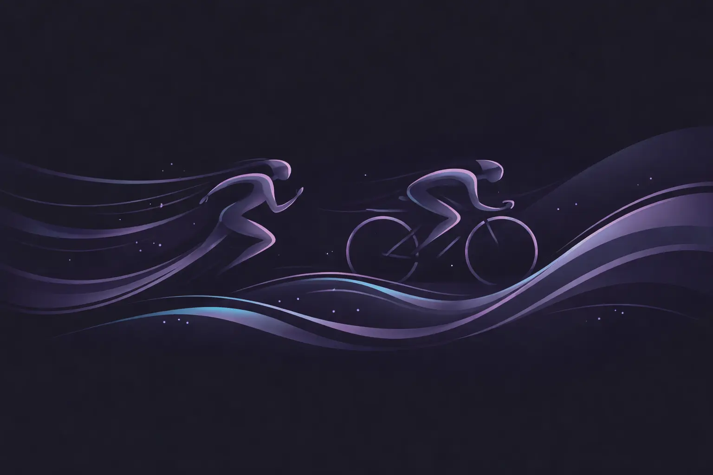

# PACE (Strava Activity Image Generator)

**PACE** (**P**ersonal **A**ctivity **C**anvas **E**ngine) is an AI-powered [Strava](https://www.strava.com/) activity image generator that automatically turns your workouts into visually compelling images. It analyzes activity data and context to create shareable, expressive visuals for each Strava activity, helping athletes present their performance and stories in a more engaging and personalized way.

