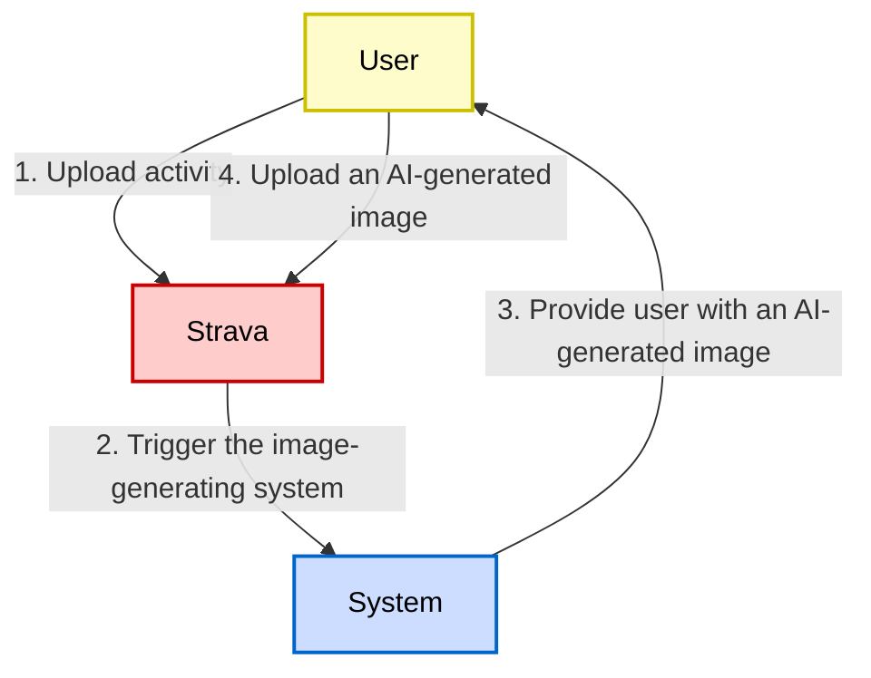
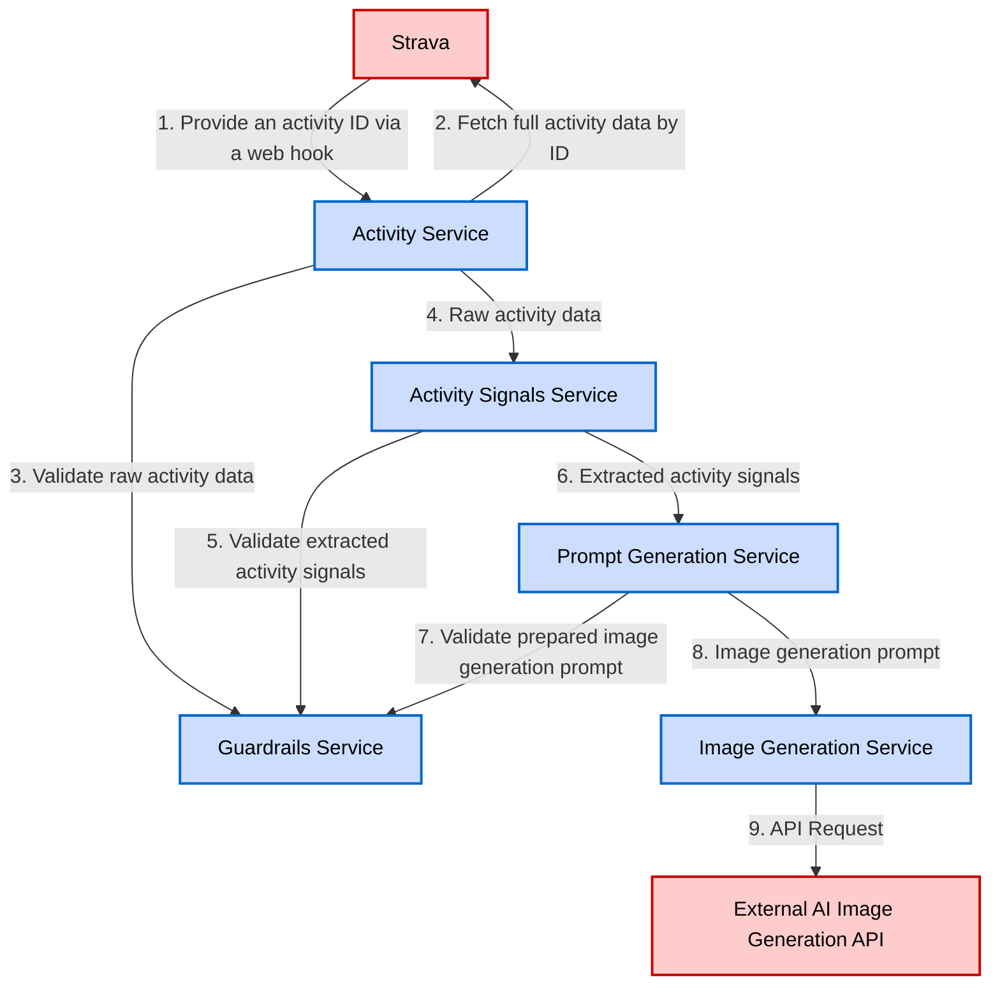

# System Architecture Design

Technical patterns, service definitions, and architectural decisions for the PACE system.

## Core Principles

The system architecture follows these principles:

1. **Single Responsibility**: Each module has one clear purpose.
2. **Loose Coupling**: Modules communicate through well-defined interfaces.
3. **High Cohesion**: Related functionality is grouped together.
4. **Dependency Injection**: Dependencies are explicit and injected.
5. **Testability**: Each module can be tested in isolation.
6. **Resilience**: Failures in one module don't cascade.

## User Journey

The system operates as a modular, service-oriented architecture with clear separation of concerns and well-defined interfaces between components.



## Services

The system consists of five core services:

1. **Guardrails Service**: Enforces all safety and content restrictions.
2. **Activity Service**: Manages Strava API integration and activity data retrieval.
3. **Activity Signals Service**: Extracts semantic signals from raw Strava activity data.
4. **Prompt Generation Service**: Generates text prompts for image generation based on extracted Strava activity signals.
5. **Image Generation Service**: Generates Strava activity image based on the prompt derived from the activity data.

### Service Dependency Graph



### Service Dependency Matrix

| Service                       | Direct Dependencies                                   | Purpose of Dependency                    |
|-------------------------------|-------------------------------------------------------|------------------------------------------|
| **Guardrails Service**        | None                                                  | Independent validation service           |
| **Activity Service**          | 1. Guardrails Service                                 | 1. Content validation                    |
| **Activity Signals Service**  | 1. Guardrails Service                                 | 1. Signal validation                     |
| **Prompt Generation Service** | 1. Activity Signals Service<br/>2. Guardrails Service | 1. Signal input<br/>2. Prompt validation |
| **Image Generation Service**  | 1. Prompt Generation Service                          | 2. Prompt source                         |

## Service Interfaces

### Guardrails Service

**Purpose**: Enforces all safety and content restrictions.

**Responsibilities**:
- Validate content against forbidden lists.
- Check for prohibited patterns.
- Sanitize user input and system output.
- Enforce compliance rules.

**Dependencies**: None

**Interface**:
```typescript
interface GuardrailsService {
  validateActivity(activity: Activity): ValidationResult
  validateActivitySignals(signals: ActivitySignals): ValidationResult
  validateActivityImagePrompt(prompt: ActivityImagePrompt): ValidationResult
}
```

### Activity Service

**Purpose**: Manages Strava API integration and activity data retrieval.

**Responsibilities**:
- Authenticate with Strava API.
- Fetch activity data.
- Transform API responses to internal format.

**Dependencies**: Guardrails Service

**Interface**:
```typescript
interface ActivityService {
  fetchActivity(activityId: string): Promise<Activity>;
}
```

### Activity Signals Service

**Purpose**: Extracts semantic signals from raw Strava activity data.

**Responsibilities**:
- Parse user-provided text safely.
- Extract activity signals from the Strava API response: subject, style, mood, scene, and others.

**Dependencies**: Guardrails Service

**Interface**:
```typescript
interface ActivitySignalsService {
  getSignals(activity: Activity): Promise<ActivitySignals>;
}
```

### Prompt Generation Service

**Purpose**: Generates text prompts for image generation based on extracted Strava activity signals.

**Responsibilities**:
- Apply prompt generation rules.
- Select appropriate style.
- Compose scene descriptions.
- Validate prompt safety.

**Dependencies**: Activity Signals Service, Guardrails Service

**Interface**:
```typescript
interface PromptGenerationService {
  generatePrompt(signals: ActivitySignals): ActivityImagePrompt
  getFallbackPrompt(): ActivityImagePrompt
}
```

### Image Generation Service

**Purpose**: Generates Strava activity image based on the prompt derived from the activity data.

**Responsibilities**:
- Submit prompts to image generation API.
- Handle generation retries.
- Manage rate limiting.

**Dependencies**: Prompt Generation Service

**Interface**:
```typescript
interface ImageGenerationService {
  generateImage(prompt: ActivityImagePrompt): Promise<ActivityImage>
  regenerateWithFallback(prompt: ActivityImagePrompt): Promise<ActivityImage>
}
```

## Data Flow

### Primary Flow: New Activity to AI Image Generation

1. **Input**: Activity ID from the Strava web hook.
2. **Activity Service**: Fetches activity from the Strava API.
3. **Guardrails Service**: Validates raw activity data for safety.
4. **Activity Signals Service**: Extracts semantic signals from the raw Strava activity data.
5. **Prompt Generation Service**: Creates image prompt based on extracted activity signals.
6. **Guardrails Service**: Validates image prompt for safety.
7. **Image Generation Service**: Generates image using the prompt.
8. **Output**: Generated image URL is shared with the requestor.

### Error Flow

1. Any service failure triggers error logging.
2. Fallback mechanisms activate for persistent failures.
3. System returns a safe default output.

## Strava API Integration

### Get Activity API

[The Strava Get Activity API is described in detail here.](https://developers.strava.com/docs/reference/#api-Activities-getActivityById) The endpoint returns the requested activity that is owned by the authenticated athlete. Requires `activity:read` for `Everyone` and `Followers` activities. Requires `activity:read_all` for `Only Me` activities. Review the Strava documentation periodically and update this section when Strava API changes are recognized.

```text
GET /activities/{activityId}
```

#### Parameters

- `id: string` - The identifier of the activity. Required.

#### Sample Response

The API returns a comprehensive activity object including:
- Basic metadata (id, name, type, sport_type)
- Performance metrics (distance, time, elevation, speed, power, heart rate)
- Geographic data (start/end coordinates, map polyline)
- Social data (kudos, comments, achievements)
- Equipment data (gear information)
- Segment efforts and splits

See the [Strava API documentation](https://developers.strava.com/docs/reference/#api-Activities-getActivityById) for the complete response schema.

## Testing Strategy

### Unit Testing

- Each service **MUST** be tested in isolation.
- Mock dependencies are injected.
- 100% coverage for critical paths.
- Edge cases and error conditions.

### Integration Testing

- Test service interactions.
- Verify data flow.
- Test error propagation.
- Validate contracts.

### End-to-End Testing

- Complete flow validation.
- Failure scenario testing.

## Deployment Considerations

### Service Packaging

- Each module as separate package.
- Clear version management.
- Dependency declaration.
- Build automation.

### Configuration Management

- Environment-specific configs.
- Secret management.

### Scalability

- Stateless service design.
- Horizontal scaling capability.
- Rate limiting.

## Future Extensions

The architecture supports future additions:
- New activity types.
- Additional image styles.
- Multiple AI model providers.
- User preferences.
- Batch processing.
- Webhook integrations.
